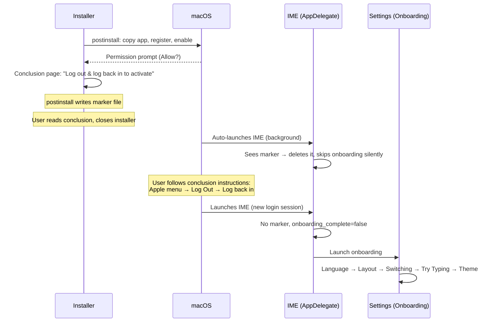

# Fix macOS Install + Onboarding Flow

## Root Cause

| #   | Problem                                   | Why                                                                                                                                                                              |
| --- | ----------------------------------------- | -------------------------------------------------------------------------------------------------------------------------------------------------------------------------------- |
| 1   | **Permission asked twice**                | `postinstall` calls `TISEnableInputSource` → macOS permission prompt. Conclusion page says "macOS will ask permission." Onboarding Step 1 shows "Enable" button again.           |
| 2   | **Onboarding starts before logout/login** | After install, macOS auto-launches IME from `~/Library/Input Methods/`. AppDelegate sees `onboarding_complete=false` → launches onboarding immediately, before user logs out/in. |
| 3   | **Try Typing doesn't work**               | IME can't intercept keyboard input until after logout/login. Onboarding Step 3 is unreachable in a working state.                                                                |

## Correct Sequence

## Changes

### 1. `postinstall` — Add relogin marker

- After registration steps, create `~/.bangla-keyboard-needs-relogin`
- Signals to AppDelegate that the user hasn't logged out/in yet

### 2. `conclusion.html` — Streamline messaging

- Remove Step 1 (permission prompt — already happened during postinstall)
- Simplify to: installed → log out/in → onboarding will guide you
- Keep the manual fallback note

### 3. `AppDelegate.swift` — Gate onboarding on marker

- On launch, check for `~/.bangla-keyboard-needs-relogin`
- If marker exists → delete it, do NOT launch onboarding (pre-login launch)
- If marker absent AND `onboarding_complete=false` → launch onboarding (post-login launch)

### 4. `Onboarding.svelte` — Remove redundant setup/enable UI

- Step 1 (Setup): Remove IME status check, "Enable" button, and manual enable instructions
- Keep only the **hotkeys section** (how to switch between Bangla/English)
- Rename step from "Setup" to "Switching"
- Step order: Language → Switching → Layout → Try Typing → Theme

### 5. `i18n.js` — Update strings

- Update step name from "Setup" to "Switching"
- Remove `onboarding.setup.checking`, `.ready`, `.notReady`, `.enableButton`, `.manualTitle`
- Remove `onboarding.enable.mac.step1-4` and `onboarding.enable.win.step1-4`
- Update `onboarding.setup.title/desc` to focus on switching, not enabling
- Update both `en` and `bn` translations

### 6. Tests

- `Onboarding.test.js`: Remove/update tests for IME status check and enable flow; add test that Step 1 shows hotkeys without enable button
- AppDelegate: Verify marker file logic — onboarding skipped when marker present, shown when absent
- postinstall: Verify marker file is created after registration

## Files Modified

| File                                                                       | Change                                  |
| -------------------------------------------------------------------------- | --------------------------------------- |
| `app/platform/macos/package/postinstall`                                   | Add marker file creation                |
| `app/platform/macos/package/conclusion.html`                               | Remove permission step, streamline      |
| `app/platform/macos/BanglaKeyboard/AppDelegate.swift`                      | Gate onboarding on marker file          |
| `app/crates/tauri-settings/src-frontend/src/components/Onboarding.svelte`  | Remove enable/permission UI from Step 1 |
| `app/crates/tauri-settings/src-frontend/src/lib/i18n.js`                   | Update/remove setup strings (en + bn)   |
| `app/crates/tauri-settings/src-frontend/src/components/Onboarding.test.js` | Update step tests                       |

## Edge Cases

- **Reinstall**: postinstall always recreates the marker → same flow
- **User skips logout/login**: Onboarding will show on next login
- **Marker persists across crashes**: Marker is deleted on first IME launch; at worst onboarding is delayed one launch cycle
